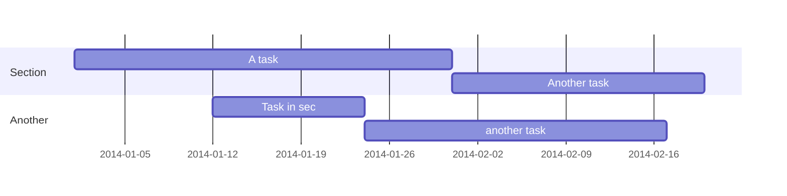

Build a foundation in Python.

<!--more-->

 1-2 hours per week, for 8 weeks

{}
A Markdown callout is useful for displaying notices, hints, or definitions to your readers.
{}


```markmap {height="200px"}
- Hugo Modules
  - blox-tailwind
  - blox-plugins-netlify
  - blox-plugins-netlify-cms
  - blox-plugins-reveal
```
## Learn



## Quiz


Lists

- Lists are mutable - they can be changed
- Slower than tuples
- Syntax: `a_list = [1, 2.0, 'Hello world']`

Tuples

- Tuples are immutable - they can't be changed
- Tuples are faster than lists
- Syntax: `a_tuple = (1, 2.0, 'Hello world')`
  


Yes



