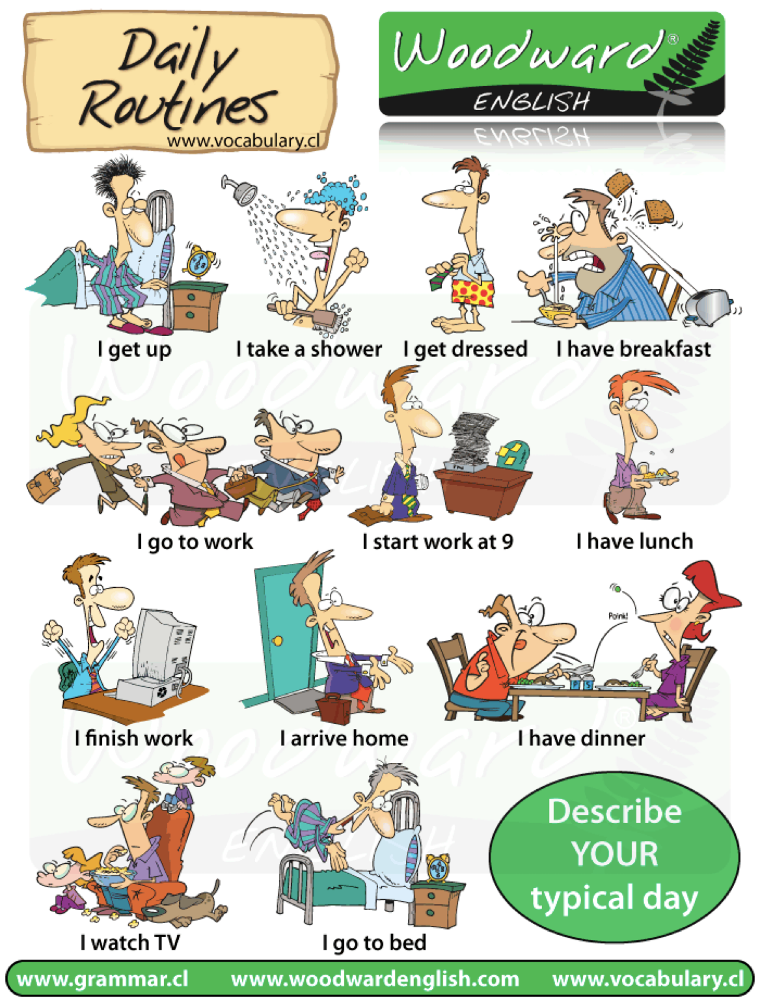

<h1 class="r-fit-text">第十一課</h1>

我玩兒得非常高興

---

<h2 class="r-fit-text">How to use 得</h1>

---

## V+得+很/真/非常+Adj

- 我吃飯，很快 → 我吃得很快
- 她畫畫兒，真好 → 
- 他唱歌，很好聽 →

---

## V+得+很不/真不/非常不/不+Adj

- 我吃飯，不快 → 我吃得不快
- 她畫畫，真不好 →
- 她唱歌，非常不好聽 →

---

## V+O+V+得+很/真/非常+Adj

- 他畫畫兒，真好 → 他畫畫兒畫得真好
- 我吃飯，很快 →
- 她唱歌，非常好聽 →
---

## V+O+V+得+很不/真不/非常不+Adj

- 他畫畫兒，真不好 → 他畫畫兒畫得真不好
- 我吃飯，不快 →
- 她唱歌，非常不好聽 →

---

## S，O+V+得+很/真/非常+Adj

- 你朋友說華語說得很好 → 你朋友，華語說得很好。
- 你寫字寫得真漂亮 →
- 她兒子念書念得很好 → 

---

## S，O+V+得+很不/真不/不太+Adj

- 你朋友說漢語說得不太好 → 你朋友，漢語說得不太好。
- 你寫日本字寫得不好看 →
- 她兒子念書念得不好 →

---

## S的O+V+得+很/真/非常+Adj

- 你朋友說漢語說得很好 → 你朋友的漢語說得很好。
- 你寫字寫得真漂亮 →
- 她兒子念書念得很好 →
---

## S的O+V+得+很不/真不/不太+Adj

- 你朋友說漢語說得不太好 → 你朋友的漢語說得不太好
- 你寫日本字寫得不好看 → 
- 她兒子念書念得不好 →

---



## 練習 3-1：問題

<h3 style="background-color: beige; color: black; display: inline">今天下雨嗎？</h3>

--- 



## 練習 3-1：語法

- S的O+V+得 + 很/真/非常/不太 Adj
- S，O+V+很/真/非常/不太+Adj
- S+V+O+V+得+很/真/非常/不太+Adj
- S+V+得+很/真/非常/不太+Adj

---



## 練習 3-2：問題

<h3 style="background-color: beige; color: black; display: inline">他做的菜，好吃嗎？</h3>

---



## 練習 3-2：語法

- S的O+V+得 + 很/真/非常/不太 Adj
- S，O+V+很/真/非常/不太+Adj
- S+V+O+V+得+很/真/非常/不太+Adj
- S+V+得+很/真/非常/不太+Adj

---



## 練習 3-3：問題

<h3 style="background-color: beige; color: black; display: inline">他買衣服，買得多不多？</h3>

---



## 練習 3-3：語法

- S的O+V+得 + 很/真/非常/不太 Adj
- S，O+V+很/真/非常/不太+Adj
- S+V+O+V+得+很/真/非常/不太+Adj
- S+V+得+很/真/非常/不太+Adj

---

## 問答練習 2-1

1. 學校附近的麻辣燙，你覺得怎樣？
1. Black Pink 唱歌唱得怎麼樣？
1. 你在宋卡王子大學學什麼？難不難？為什麼？
1. 你喜歡看電影嗎？說一說你喜歡的電影。
1. Central 百貨公司，東西貴不貴？

---

## 問答練習 2-2

1. 你的家人做的飯菜，味道怎麼樣？
1. 你星期六、星期日去哪裡玩？玩得怎麼樣？
1. 說一說你上次的旅行怎麼樣。
1. 咖啡店的咖啡，跟 7-11 的，有什麼不一樣？（泡咖啡）
1. 說一說你喜歡的課。

---

<h2 class="r-fit-text">How to use 了<h2>

---

## Usage of 了

- [whole sentence]＋了。
- [Verb]＋了＋……
- V+了+[quantified object/duration]+了
- V+了+[NOT quantified object]+了

---

<h2 style="text-transform: capitalize"> [whole sentence]＋了。</h2>

When 了 appears at the end of a sentence, it expresses a new situation or change of state. 

- V+O+了
- 已經＋N＋了

---
## 例子 2-1

> [whole sentence]＋了。

- 他以前是瘦的／他現在是胖的	
  - → 他現在胖了。
	
- 我去年十七歲／我今年十八歲 
  - → 我今年十八歲了。

---

## 例子 2-2

> [whole sentence]＋了。

- 我現在學漢語／我覺得很難，所以不想學
  - →我以後不學了。
	
- 星期一在泰國／星期二去日本／現在他還在日本，還沒回來
  - → 他去日本了

---

## 練習 4-1：問題

- 他以前是學生／他現在當老師 →
- 弟弟以前喝酒／弟弟現在不喝酒 →
- 以前他不會用電腦／他現在會用電腦 →
- 爸爸昨天40歲／爸爸今天41歲生日 →
- 我的iPhone剛才有電／我的iPhone現在沒電 →

---



## 練習 4-2：問題

<h3 style="background-color: beige; color: black; display: inline">Adele 以前跟現在，一樣嗎？</h3>

---



## 練習 4-3：問題

<h3 style="background-color: beige; color: black; display: inline">他以前跟現在，一樣嗎？</h3>

---



## 練習 4-4：問題

<h3 style="background-color: beige; color: black; display: inline">她以前跟現在，一樣嗎？</h3>

---

## 問答練習 2-1

- 你以前會寫漢字嗎？現在呢？
- 你今年是幾年級？明年呢？
- 你去年幾歲？今年呢？
- 一小時以前是幾點幾分？現在幾點幾分？

---

## 問答練習 2-2

-	一周以前是幾月？現在是幾月？
- 你念高中（high school）的時候多高？現在多高？
- 你家人早上六點在家嗎？現在還在家嗎？
- 九點的時候學生都來了嗎？現在呢？

---

<h2 style="text-transform: capitalize">[Verb]＋了＋……</h2>

When 了 appears right after a verb, it expresses that an action is completed. 

- V1＋了＋O，V2+了……
- V＋了＋place
- V＋了＋duration

---

## 例子

> V1＋了＋O，V2+了……

- 晚上五點寫作業／六點吃飯／七點看電視
  - → 他寫了作業，吃了飯，現在正在看電視。
	
- 明天我打算九點跳舞／九點半去上課
  - → 明天我打算跳了舞，再去上課。

---

## 例子

> [Verb]＋了＋ place / duration

- 星期一在泰國／星期二去日本／星期三他回泰國來，現在他在泰國
  - → 他去了日本
	
- 我去年在英國學英語，從五月學到八月
  - → 去年，我在英國學英語學了三個月

---

<h2 style="display: none">練習 2-1</h2>

---

<h2 style="display: none">練習 2-2</h2>

---

## 問答練習 2-1

- 你現在學華語二，學了華語二以後，你打算學什麼？
- 你今天等車來上課，等了多長時間？
- 你去年學華語一，學了多長時間？
- 你昨天吃晚飯，吃了多長時間？

---

## 問答練習 2-2

- 你昨天早上做了些什麼？ 
- 你潑水節（สงกรานต์）打算去哪些地方玩兒？
- 考試的時候，你總是先念什麼？再念什麼？
- 從學校怎麼去Central Festival？

---

<h2 style="text-transform: capitalize">V+了+...+了</h2>

The action has been progressing up to the time when it is brought up in the conversation and is still progressing.
 
- V＋了＋Nu-M-N＋了
- V＋了＋time duration＋了

---

## 例子 2-1

> V+了+[quantified object/duration]+了

- 她學習漢語學了一年了。（現在還在學）
	
- 他已經吃了五個麵包了。（現在要吃第六個）

---

## 例子 2-2

> V+了+[quantified object/duration]+了

- 我今天得念六個小時的書，現在已經念了四個小時了。（還有兩個小時）
- 我想買那件衣服，想了很長的時間了。（現在還一直在想）

---

## 問答練習 1-1

- 我們上課上了多長時間了？
- 你今年已經看了幾本書了？
- 你學英語學了多長時間了？
- 你來宋卡王子大學來了多長時間了？

--- 

## 補充

 V+了+[NOT quantified object]+了  ＝ V＋O＋了

- 我念了書了 ＝ 我念書了（以前沒念）
- 我今天寫了作業了 ＝ 我今天寫作業了（昨天沒寫）
- 我昨天買了房子了 ＝ 我昨天買房子了（我打算買房子，可是一直沒買，昨天我買了。）